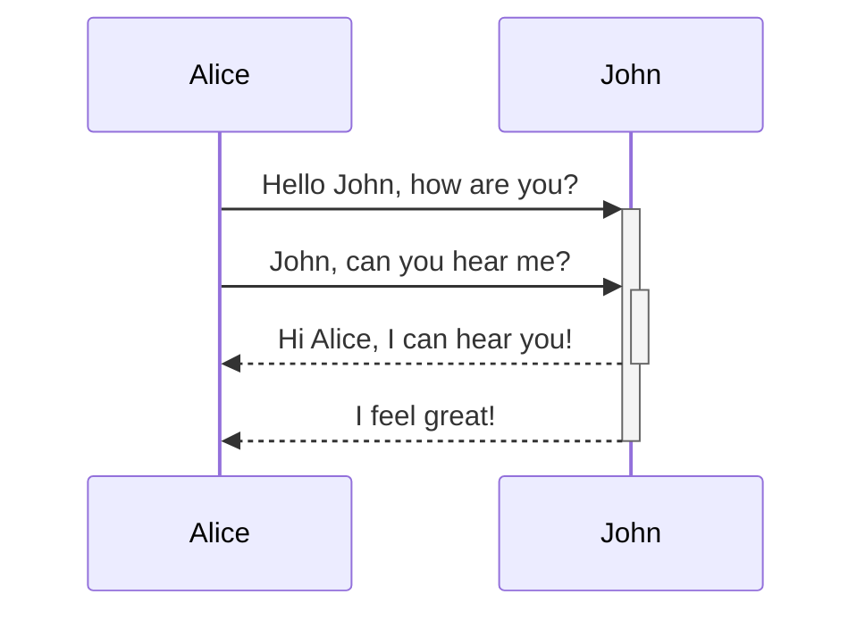

This guide provides style, usage, and Markdown information to write, edit, and submit content to the Riot Platform Docs Portal.

## Using Style and Word Choice Best Practices

Most of {{docteam}}'s style and formatting conventions are are based on [Microsoft Manual of Style](https://docs.microsoft.com/en-us/style-guide/welcome/) with some exceptions noted in this section. In addition to the Microsoft Manual, use the following best practices.

### Structure and Presentation
Structure your guidance to make it as easy as possible to follow:

* State the objective with the use case or problem to solve. 
* Provide as much introductory technical context as needed without over-explaining. Link to reference content when helpful.
* Precede any steps with prerequisites, such as services or plug-ins that the developer needs to install first.
* Break down lengthy procedures into subtasks, each with a clear objective. For example, integrating a product into Riot Client involves:
  * Setting up the product repo for Client Config
  * Setting up entitlements
  * Setting up patchlines
  * Setting up a product repo

* Use examples, code samples, and screenshots when helpful.

### Style and Grammar  

Use the following best practices to keep your guidance concise, clear, and helpful:

* Make topic titles and headings descriptive. Use imperative for H1 and H2 headings and title case, for example:

  *Create Your Repository*

Use H3-level headings to introduce processes and ordered tasks, in the Quick Start guide template, H3 can be numbered for clarity. H3-level headings should be gerunds and if they are used as a step are in sentence case. Otherwise, use title case and gerunds.

[[note]]
| An in-topic table of contents that appears on the right side of each topic page lists H2- and H3-level Headings.

* Create an objective introductory statement. For example:

  * Use this topic to register your client...*
 
* Add a criteria for identifying success at the end of your topic, or include next steps to refer to the next series of required steps to complete the process. For example:

   * After completing this section, your client will be successfully registered, and you can choose one of the following processes...*
   
* Write in active voice, which clarifies the doer of an action. For example:

  *You can create a .json file...*

  instead of

  *A .json file can be created...*

* Precede a list of steps with a call to action. For example:
  *Set up a repo for Client Config:*

    1\. *Step*
    2\. *Step*
    3\. *Step*

* Precede an unordered list with a summarizing sentence or call to action. For example:

  *Make sure you configure the following settings:*

  * *Setting*
  * *Setting*
  * *Setting*

* Use second-person address (*you*) whenever possible. It makes for a more engaging tone and avoids the awkwardness of third-party reference, which is often unnecessary, since the site navigation contextualizes the intended audience. For example:

  *You can use Client Config…*

  Instead of

  *Game developers can use Client Config…*

* Use imperative voice whenever possible to convey an instructive, guiding tone. For example:

  *Install the following plug-ins before you proceed:*

  Instead of

  *You must have the following plug-ins installed before you proceed:*

* Keep sentences short. If a sentence seems to convey more than one thought, break it into two. For example:

  *Get access to an Active Directory service account that is set up to deploy your builds. Use that account for the deploy and publish steps.*

  Instead of:

  *Get access to an Active Directory service account that is set up to deploy your builds, which is the account you should use for the deploy and publish steps.*


* <a name="4hyperlinks"></a>For hyperlinks, use specific words instead of vague phrases like *click here* or *this page*. For example:

  *See [Migrating from Gas to Atlas](#4hyperlinks).*

  Instead of

  *Click [here](#4hyperlinks) for information on migrating from Gas to Atlas.*

* Define or spell out an acronym on first reference in a topic, followed by the acronym in parentheses. Then use the acronym in subsequent references.

* When introducing a service, process, or tool that may be called a by a different name, note that name to avoid any confusion. For example, depending on the context, *Riot Client* may also be referred to as the *desktop {{sdk}}*.

* Precede the last item in a series with an Oxford comma. Example:

   *The Chat API includes friends, presences, and conversation endpoints.*

### Words and Phrases Not to Use

Avoid using the following words, types of words, or phrases:

* **Contractions**, such as *don't* or *should not*, are allowed by Microsoft Style Guide, but they can be problematic if localization becomes a requirement. English contractions may not be recognizable to all translators, potentially resulting in additional time and cost.

* **Colloquialisms** are geographically specific expressions that can cause problems for localization or for readers for whom English is a second language. Examples:

  * *kick off*
  * *fire up*
  * *run it past*
  * *deep dive*
  * *get rolling*

* **Latin words and abbreviations** are often misused and can cause confusion. Use English phrases. Examples:

  * *e.g.* - Use *such as* or *for example*.
  * *etc.* - Instead of adding this to an incomplete series, precede the series with *such as*.
  * *ergo* - Use *so*.
  * *i.e.* - Use *also named* or *also called*.
  * *v.s.* - Use *instead of*.
  * *via* - Use *by* or *through*.

* Other words are either unnecessary, misused, or misleading. Examples:

  * *get* - Use only for the REST API method. Otherwise, use *obtain*.
  * *per* - Use only when defining rates, such as *per second*. Otherwise use *according to*.
  * *please* - A directly imperative, instructive style makes this word unnecessary.
  * *usage* - Use the noun *use*.
  * *we* - Use *Riot*, *Riot Platform* or a name that identifies the subject of the phrase. Also, avoid using *we* to rhetorically refer to instructor and audience as in *In this topic, we will learn...* Use second-person reference (*you*).
  * *like* - Use *for example* or *such as* when using like to introduce a comparison or example.

## Formatting Text

In addition to using the following guidelines, see *contributors/topic-template.md* for examples on how to format elements such as front matter, tables, code samples, and callouts.

Use the following formatting conventions for consistency:

* Use **bold** for emphasis.
* Use *italics* for directory paths and files, such as *local-git-repo/folder/file.md*, or to introduce new terms if helpful.
* Use a line break before and after images and an important callout, tip, or note.

### Font Awesome

The Doc Portal supports [Font Awesome](https://fontawesome.com/) (free version) for icons. 

To add an icon:

1. Search for and select an icon.
2. Select **Start Using This Icon**.
3. Copy the HTML code and add to a document. For example, star would use `<i class="far fa-star"></i>` and displays as <i class="far fa-star"></i>.

You can add styles to the icon, including:  


| Format | Description |
| -- | -- |
| `fa-flip-horizontal`<br/>`fa-flip-vertical` | Flips the icon left and right, or top and bottom. |
| `fa-rotate-90`<br/>`fa-rotate-180` | Rotates the icon by 90 degree increments. |
| `fa-lg` | [Resizes](https://fontawesome.com/how-to-use/on-the-web/styling/sizing-icons) the image including xs, sm, lg, 2x to 10x. All icons inherit the font size of the paragraph CSS. |
| `style="font-color: #D13639; font-size: 1.15em;"` | Adds a color to the icon, for example <i class="far fa-star" style="color: #D13639; font-size: 1.15em;"></i>. |

See [Basic Use](https://fontawesome.com/how-to-use/on-the-web/referencing-icons/basic-use) for more examples and information. 

[[note]]
| Contact ([#ask-portal-docs](https://riotgames.slack.com/messages/CKFJMLULA/)) to add a specific icon with CSS formatting to use across the doc portal.

### Hyperlinks

Structure hyperlink references to match the Platform Portal Docs directory relative paths as defined in the appropriate [YAML file](#yaml). Links are based on titles in the YAML file, not topic file names.

* Structure **[Integration](/docs)** topic paths as */docs/[integration_milestone]/child_topic_name*.  For example:

  *\[Creating entitlements\](/docs/set-up-access-and-distribution/creating-entitlements)*

* Structure **[Reference](/reference-docs)** topic paths as */reference-docs/[service_category]/child_topic_name*.  For example:

  *\[Using Single Sign-On\](/reference-docs/authentication/using-single-sign-on)*

* Structure **[Release Notes](/release-notes)** paths as */release-notes/[release-notes_category]/child-topic-name*.  For example:

  *\[October 7, 2019\](/release-notes/riot-client-sdk-and-riotgamesapi-release-notes/october-7-2019)*

You can also add a link to a specific heading in a file using a hashtag and heading name. For example, `/reference-docs/platform-content-distribution/patchcli-tool/deploy#patchattributes-file` links to the *.patchattributes* File section in the Deploy Command topic.

[[note]]
| **Note:** Do not include a file extension for the child topic in a hyperlink.

### Repo Resources

* Make topic file names descriptive, so that repo collaborators can identify their subject matter. Example: 
*finding-entitlement-tags.md*
* Save static image files, such as *.png or *.jpg, in the *static* folder. Insert an image file link into a topic using the format:

  *!\[Alt_text\](/static/image_name.png)*

* Save video in a Google Drive and embed into markdown. See [Google Drive Videos](#google-drive-videos).

* Save video files in the *static/video* folder. Insert a video file link into a topic using the format:

  *\!video[file-name.mp4]*

* Save downloadable files in the *static* folder. Insert a downloadable file into a topic using the format:

  *<a href="/static/filename.js" download\>Name of Link</a\>*

* Add a button with custom text and link to a website or documentation in the repo. The button best supports two to three words for the text.

  *\!riotbutton[button text]\(link-here)*

* {{docteam}} only - Make sure topic files are saved in correct directories.
* {{docteam}} only - Update navigation (yaml files) with new topics.

## Style and Formatting Development Content

Use the following formats and styles when documenting development endpoints and content:

* Introduce APIs with a gerund and descriptive heading. For example:

  *Using the Get Match History Summary Endpoint*

  instead of

  *Get Match History Summary API*

* Use **Request** and **Response** bolded text when providing the call and results for an API endpoint.

* Use a table for parameters, inputs, and responses. Long lists of bulleted parameter definitions may be difficult to review and use for code samples. For example:

  | Data | Description |
  | -- | -- |
  | `gameID` | Unique game ID |
  | `gameType` | Game mode for the match, such as ranked, ARAM, and unranked |
  | `gameStart` | Date timestamp when the match started |
  | `gameDuration` | Duration of the match |
  | `PlayerMatchSummary` | Provides additional player, game, and match information collected during the match, see the `PlayerList` |

* Use inline code formatting for technical elements such as parameters, names of endpoints or servers, or commands. If text also includes `<` `>`, wrap in inline code to properly generate and show the content. Include the code language when defining the code sample to make it match the style of the language. Example:

  *\```json*
  *sample_code*
  *\```*

  Renders as:

  ```json
  [
   {
     "sample_code": "sample",
   }
  ]
  ```

  See *contributors/topic-template.md* for code sample formatting.

* Use proper syntax in code samples so that developers can copy and paste them.

[[note]]
|  **Note:** Platform Portal Docs supports a selection of languages from RehypePrism using [Refractor](https://github.com/wooorm/refractor). These include JavaScript, JSON, C++, CSharp, Python, Java, Bash (console), and SQL. [Additional languages](https://github.com/wooorm/refractor/tree/master/lang) can be added anytime by contacting the team ([#ask-portal-docs](https://riotgames.slack.com/messages/CKFJMLULA/)).

## Using Markdown Syntax

For guidance on Markdown formatting, see the [GitHub Flavored Markdown Spec](https://github.github.com/gfm/), which is the primary source for the documentation portal Markdown syntax. Also, review the following custom block and format support. See [Integration Template](/docs/contribute-documentation/integration-template) to see Markdown formats, and the [source file](https://gh.riotgames.com/RPG/docs.rpg.riotgames.io/blob/master/docs/integration/contributing/topic-template.md) to start writing.

If you would like special formats or have requests, contact [#ask-platform-docs](https://riotgames.slack.com/messages/CKFJMLULA/).

### Using Code Formats

Code syntax highlighting uses [Refractor](https://github.com/wooorm/refractor) and [Prismjs](https://prismjs.com/) for [languages](https://prismjs.com/#languages-list). The supported languages include XML, HTML, JavaScript, SQL, Bash, YAML, Java, Markdown, JSON, C#, C++, Groovy, and Python.

When introducing code samples, include the language used and type of call to help introduce the content to fellow developers using the samples for integrations.

The Docs team can add [languages](https://prismjs.com/#languages-list) on request. Contact [#ask-platform-docs](https://riotgames.slack.com/messages/CKFJMLULA/).

### Using Mermaid

The Riot Platform Docs Portal supports [Mermaid](https://mermaid-js.github.io/mermaid/#/) for flow charts, sequence diagrams, class diagrams, state diagrams, Gannt charts, pie charts, and entity relationship diagrams. Use the Mermaid [live editor](https://mermaid-js.github.io/mermaid-live-editor/#/edit/eyJjb2RlIjoiZ3JhcGggVERcbiAgQVtDaHJpc3RtYXNdIC0tPnxHZXQgbW9uZXl8IEIoR28gc2hvcHBpbmcpXG4gIEIgLS0-IEN7TGV0IG1lIHRoaW5rfVxuICBDIC0tPnxPbmV8IERbTGFwdG9wXVxuICBDIC0tPnxUd298IEVbaVBob25lXVxuICBDIC0tPnxUaHJlZXwgRltmYTpmYS1jYXIgQ2FyXVxuXHRcdCIsIm1lcm1haWQiOnsidGhlbWUiOiJkZWZhdWx0In19) to generate a diagram, adding the code inline to your Markdown files. 

[[important]]
| **Important:** Mermaid code must be inline with your content using the fenced code ticks. It must not be in a separate file.

\```mermaid
sequenceDiagram
	Alice->>+John: Hello John, how are you?
	Alice->>+John: John, can you hear me?
	John-->>-Alice: Hi Alice, I can hear you!
	John-->>-Alice: I feel great!
\```

The content renders as:



[[docs]]
| **Guide:** See [Building Mermaid Diagrams](/docs/contribute-documentation/building-mermaid-diagrams) for code and diagram examples, quick starts, and guides.

### Using Table Formats

Custom table formats are available for Markdown tables. To use these tables, add the custom format before the markdown table:

```markdown
[[nameofformat]]
| Normal | Markdown | Table |
| -- | -- | -- |
| `normal` | Markdown | Content in your rows. Nothing fancy required. |
```

See the [Integration template](/docs/contribute-documentation/integration-template#table-formats) for examples.

Available formats include:

* `[[longtable]]` - A default table format with the heading sticky to follow with scrolling, for example [Competitive Research Analysis](/reference-docs/legal-and-compliance/competitive-research-analysis) 
* `[[diagram]]` - A blue scheme with spacing between cells great for diagraming information, for example [What Your PS Producer Does](/docs/partner-with-player-support/ps-early-production/what-your-ps-producer-does) 
* `[[linkblock]]` - A table with an image (icons available in /static/icons) and text in the header with clickable rows, for example [Getting Started](/docs)
* `[[timeline]]` and `[[timelinerows]]` - A timeline look with an image, text, and descriptions in rows, for example [Partner with Player Support](/docs/partner-with-player-support) and [Integrate Player Support Tools](/docs/integrate-player-support-tools)
* `[[columns]]` - A phases or process steps table with blue gradient header, for example [Columns table](/docs/contribute-documentation/integration-template#columns)
* `[[chart]]` - A phases or process steps table with blue gradient header with a side header, for example [[Find Your Support Level]](/docs/integrate-player-support-tools/about-levels-of-support#find-your-support-level)
* `[[info]]` - A table with the first column as the header, with the traditional top header hidden, for example [[PS Support Level 1]](/docs/integrate-player-support-tools/about-levels-of-support/support-level-one).

### Using Note Formats

The site provides custom blocks to call out content. These provide a shaded box with an icon. The blocks support one or more paragraphs, using the following Markdown format:

```markdown
[[note]]
| **Note:** Add a note here. The blocks support Markdown formats.
| For multiple paragraphs, add another pipe and add content.
```

See the [Integration template](/docs/contribute-documentation/integration-template#block-formats) for examples.

Available blocks include:

* `[[note]]` - Use to inform users of helpful information to further support and provide examples for codes, concepts, and usage.
* `[[important]]` - Use to inform users of vital information, recommendations, suggestions, and best practices.
* `[[warning]]` - Use to warn users the documentation may break the service if done improperly or is confidential in nature.
* `[[docs]]` - Use to add a document link such as see also, RFC, runbook, and others

## Embedding Google Files

If you have a Google document, slideshow, or spreadsheet, you can embed the files into topics. The site shows the content in an iframe, ensuring the latest information is provided on-load, without allowing viewers to edit your content. This can be helpful for runbooks, product roadmaps, and more.

[[note]]
| **Note:** Your content remains safe when embedded. The Riot Platform Docs Portal requires VPN access and Riot account authentication.

### Google Files

To embed a Google file:

1. In your Google file, select **File** then **Publish to the web**.
2. Expand **Published content & settings** -

    * Ensure the option *Automatically republish when changes are made* is enabled. 
    * For Google Sheets, select the sheet you want to load in the iframe.
    * For Google Slides, set the slide size, auto-advance, and additional options.

3. Select **Publish**.
4. Copy the Embed iframe code.
5. In your Markdown file, paste the iframe code. 
6. Add the following style to the iframe code- `style="width: 100%; height: 400px; border: 1px solid black;"`.

For examples, see [Understanding Feature Flags](/developer-docs/developing-the-riot-games-api/test-riot-games-api/understanding-feature-flags) sheet and [Create a Design Document](/docs/integrate-player-support-tools/ps-tool-integration-process/review-designs-for-feature-lock#creating-a-design-document) doc.

### Google Drive Videos

You can embed a video using an iframe or embed code. This option gives your team control over videos and 

To embed a video from a Google Drive:

1. Save your video to a location in the Riot Games Google Drive.
2. Set the Share options for the file to anyone in *Riot Games* can *View*.
3. Open the video and select the  More Options, then select **Embed Item...**.
4. To embed as an iframe, copy the code and paste into your markdown file. For example:

  ```html
  <iframe src="https://drive.google.com/file/d/1KEHKktdSmc5YLmri4D-4fCjnQ_kwJpdi/preview" width="640" height="480"></iframe>
  ```

5. To embed as an embed, copy the `src=` URL and add it to the following code in your markdown file. For example:

  ```html
  <embed width="854" height="480" src="https://drive.google.com/file/d/1KEHKktdSmc5YLmri4D-4fCjnQ_kwJpdi/preview">
  ```

For an example, see [Writing Riot Client Integration Tests](/developer-docs/developing-the-riot-games-api/test-riot-games-api/writing-riot-client-integration-tests).

## Using Markdown Templates

See the following templates to quickly create and write content:

* [Integration template](/docs/contribute-documentation/integration-template)
* [Reference template](/docs/contribute-documentation/reference-template)
* [Release Notes template](/docs/contribute-documentation/release-notes-template)
